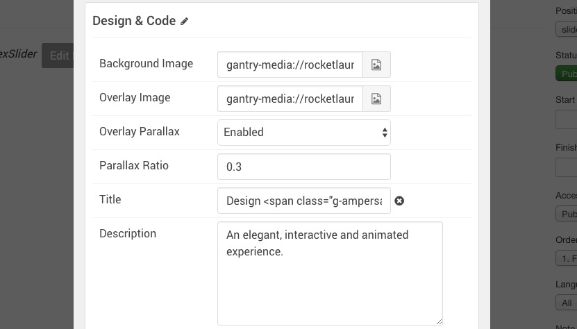

What is Gantry?
-----

[Gantry][gantry] is, as a basic definition, a framework used for assembling, building and maintaining a RocketTheme theme. It is an advanced platform for dramatically extending the capabilities of the entire theming system of Grav.

Can I install RocketLauncher onto an existing Grav website?
-----

No. RocketLauncher will install both Grav and the demo sample content and images, so you will need a fresh Grav installation.

I installed Isotope RocketLauncher but the images are different with the demo site.
-----

To avoid image license copyright issues, all sample content images shown in our demo site will be replaced with blank versions in the RocketLauncher version.

## How can I adjust parallax settings?

There are two opportunities for you to adjust parallax settings. The **FlexSlider** particle has parallax built in, allowing you to see a virtual depth effect as you scroll past the particle. Additionally, sections with background images such as **Header** and **Extension** can have this effect applied via the section's **Tag Attributes**.

To adjust the parallax settings in the **FlexSlider** particle, simply access the particle's settings and adjust the **Parallax Ratio**. A ratio of `0.3` is standard and typically set as default, however you can increase or decrease the effect by changing the number to any one between 0 and 1.0.

Adjusting the parallax effect in a section is also pretty straightforward. To do so, access the section's settings and create tag attributes `data-enllax-ratio` and `data-enllax-type`. The ratio can be assigned a numeric value just as the FlexSlider's can. The type, however, should be `background` as the background is what the effect is applied to.

[gantry]: http://gantry.org/