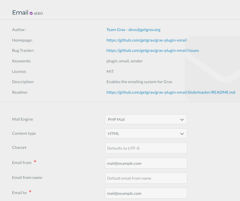

## Introduction

Contact forms make it easy for visitors to reach out and contact you. In Grav, this process works a little differently than it does in other content management systems. In this guide, we'll outline how you can customize and configure a contact form for your website.

## Getting Started

We do recommend using a RocketLauncher to start with. We've done a lot of the initial setup work for you and all you need to do is plug in your email address, and if you'd like, customize the fields you'd like your contact form to have.

If you are using a RocketLauncher, there is a contact form already set up and ready to go. You just need to edit the email address you'd like to have submissions sent to.

## Configuring Email

You can do this using the **Email from** and **Email to** fields in the **Email** plugin. Access this plugin's settings by navigating to **Admin > Plugins > Email**.

You'll also want to make sure you select a **Mail Engine** as nothing will be sent if this option is set to **Disabled**. If you want your site working right out of the box, **PHP Mail** is a good place to start.

## Customizing Fields

>> This guide is useful for folks using the RocketLauncher. If you want a full from-scratch tutorial on creating a contact form, check out [Grav's documentation](https://learn.getgrav.org/forms/forms/example-form).

If you would like to customize the fields that appear in your form, you can do so by navigating to **Admin > Pages > Form > Contact Form** and selecting **Expert** in the administrator. Here, you'll see the YAML breakdown of the contact form. It will look similar to the fields below.

~~~ .yaml
title: Contact Form

form:
  fields:
    name:
      type: text
      label: Name
      validate:
        required: true
        message: Please enter your name!
    email:
      type: text
      label: Email
      validate:
        type: email
        required: true
        message: Please enter your email address!
    subject:
      type: text
      label: Subject
      validate:
        required: true
        message: Please enter a subject for your message!
    message:
      type: textarea
      label: Message
      validate:
        required: true
        min: 10
        message: Email message needs to be more than 10 characters long!

  buttons:
    submit:
      type: submit
      value: Send Email

  process:
    email:
      from: "{{ form.value.email }}"
      to: "{{ config.plugins.email.to }}"
      subject: "[Contact] {{ form.value.subject|raw }}"
      body: "{{ form.value.message }}  {{ form.value.name }} {{ form.value.email }}"
    message: 'Thank you from contacting us!'
    display: /form/thankyou
~~~

Everything you need to concentrate on takes place within the **fields** area of this text. You can add or remove fields here. You can find a complete guide on doing this in [Grav's documentation](https://learn.getgrav.org/forms/forms/example-form).