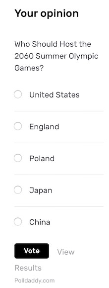
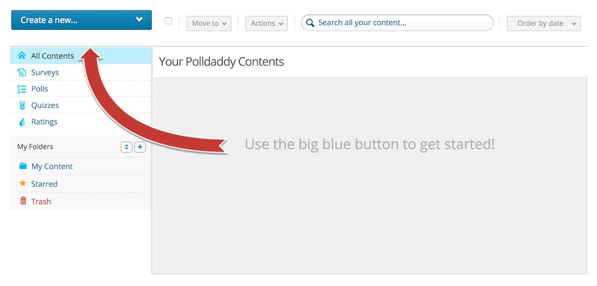

## Introduction



The **Polldaddy Voting** particle enables you to display polls created using the Polldaddy service. This particle incorporates Polldaddy's features in a way that seamlessly matches the look of Notio.

In order to use this particle, you will need to create a [Polldaddy account](https://polldaddy.com/pricing/). There are **Free** accounts available, but there are also premium features made possible at its **Pro** and **Corporate** account levels.

Here are the topics covered in this guide:

* [Configuration](#configuration)
    - [Main Options](#main-options)
    - [Item Options](#item-options)
* [Polldaddy Setup](#polldaddy-setup)

## Configuration

### Main Options 


| Option        | Description                                                                                 |
| :-----        | :-----                                                                                      |
| Particle Name | Enter the name you would like to assign to the particle. This only appears in the back end. |
| CSS Classes   | Enter the CSS class(es) you want to use in the content of the particle.                     |
| Title         | Enter a title for the particle.                                                             |
| Poll ID       | Enter a Poll ID received from Polldaddy. Instructions below.                                |

### Polldaddy Setup

Setting up a poll in Polldaddy is simple. First, you'll need to sign up for the service, and you can do this with a [Grav.com](http://grav.com) account or sign up with via [Polldaddy.com](https://polldaddy.com/pricing/).



Once you have signed in, you can start setting up a poll by clicking the blue **Create a New** button and selecting **Poll**.


Here, you can create your poll question and options you'd like to give your visitors to choose from. There are also advanced options to help you refine how your poll behaves. You can even select options to prevent repeat voting, allow comments, and more.

You can then select your poll's style options. This is largely overridden by Notio so that your poll matches the rest of your theme.

Once you have saved these settings you'll receive scripts like this one:

```
<script type="text/javascript" charset="utf-8" src="http://static.polldaddy.com/p/1234567.js"></script>
<noscript><a href="http://polldaddy.com/poll/1234567/">Test Poll</a></noscript>
```

The number (represented by `1234567` in our example) is the Poll ID. Insert this number in the **Poll ID** field of the particle.