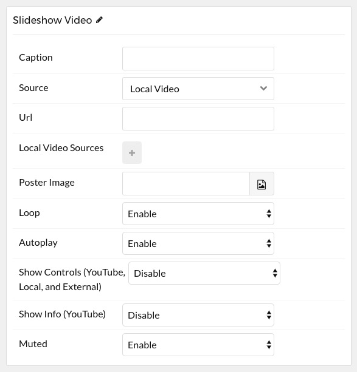

## Introduction

The **Video** particle enables you quickly and easily add video content to your page.

Here are the topics covered in this guide:

* [Configuration](#configuration)
    - [Main Options](#main-options)
    - [Item Options](#item-options)

## Configuration

### Main Options 

These options affect the main area of the particle, and not the individual items within.

| Option        | Description                                                                                 |
| :-----        | :-----                                                                                      |
| Particle Name | Enter the name you would like to assign to the particle. This only appears in the back end. |
| CSS Classes   | Sets any CSS class(es) you want to have apply to the particle's content.                    |
| Title         | Enter a title for the particle.                                                             |

### Item Options

These items make up the individual featured items in the particle.

| Option                | Description                                                                                                                                                            |
| :-----                | :-----                                                                                                                                                                 |
| Caption               | Enter a caption for the video.                                                                                                                                         |
| Source                | Enter a source (type) for the video. You can choose between: **Slideshow Preset**, **Vimeo**, **YouTube**, **Local Video**, and **External URL**. **Slideshow Preset** selects the video that is being called via your /gantry/presets.yaml file in the slideshow section for Presets 1-6.                                        |
| Local Video Source(s) | When **Local Video** is selected as the **Source**, this would be the video (or videos) you wish to load in the particle. Not all videos have to have the same format. |
| Poster Image                  | Select the background image to display before video is played.                                                                                                                                       |
| Loop                  | Enable or disable video looping.                                                                                                                                       |
| Autoplay              | Enable of disable video autoplay.                                                                                                                                      |
| Show Controls         | Show or hide controls from the embedded video's player. This is available on **YouTube**, **Local**, and **External** sources.                                                        |
| Show Info         | Show or hide top info bar. This is available for **YouTube**.                                                       |
| Muted         | Enable or disable video sound. Local / External videos must be Muted in order for Autoplay to work on Android / iOS devices.                                                       |

Since not all browsers support all video types, the **Local Video Source(s)** area enables you to select multiple videos in the particle. This will enable you to have a WebM version of the video load, and if the visitor is using a browser that doesn't support it, you can add an MP4 version of the video which will load instead. The same applies to Ogg and MOV video types.

The particle has local support for any video format that can be natively embedded using HTML5. This includes: MP4, WebM, Mov, and Ogg videos. If you would like a point of reference, we used a 1280x720 video in the RocketLauncher. This is a standard video format that is commonly available as a preset in most video encoding programs.

Variables such as your bit rate will vary depending on the type of content in the video, as well as the frame rate of the video being presented. High action and/or high framerate video will need higher bit rates while low-action video such as screencasts and shots of a plain background with little overall movement can get by with lower bit rates.

To break this down, here are some examples. You do NOT have to abide by these resolutions or video settings. We recommend strongly checking out the [HTML5 video support documentation](http://www.w3schools.com/html/html5_video.asp) available at W3 for additional perspective.

| Resolution | Video Codec | Audio Codec | Container | Bitrate   |
| :-----     | :-----      | :-----      | :-----    | :-----    |
| 320x240    | h.264       | AAC         | MP4       | 400 kbps  |
| 480x270    | h.264       | AAC         | MP4       | 700 kbps  |
| 640x360    | h.264       | AAC         | MP4       | 1400 kbps |
| 1280x720   | h.264       | AAC         | MP4       | 2500 kbps |
| 1920x1080  | h.264       | AAC         | MP4       | 4000 kbps |

To save time and resources on page loads, you will want to encode your video at a relatively low bit rate. Keep in mind that as a general rule: the lower your bit rate, the lower the quality of the video. It's almost impossible to state a one-size-fits-all bit rate that lets all videos look great while being as small in file size as possible. The best practice is to do some trial and error.

Alternatively, YouTube compresses videos for you, and it is supported by this particle. This would be the easiest method available to you, and you save on bandwidth as you won't be serving the actual video file yourself.

>> Interested in displaying the Video Particle in FullWidth? Please see [here](fullwidth_video.md).
